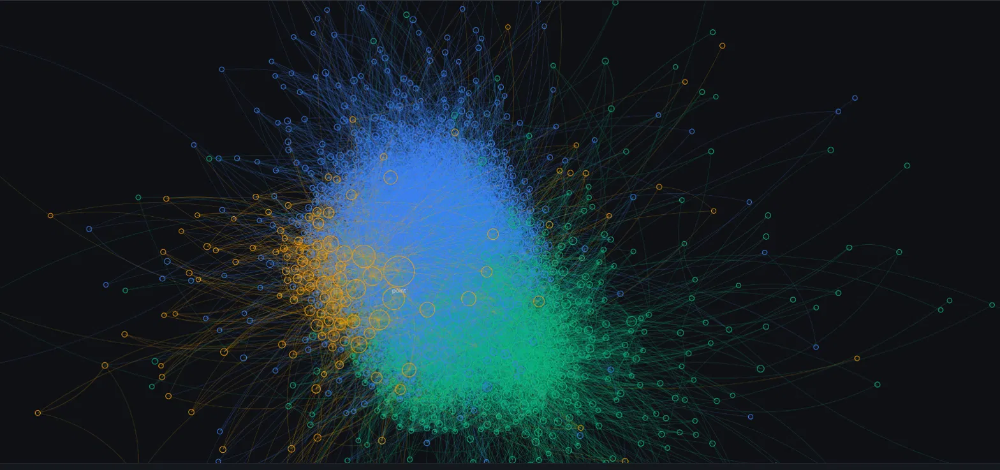
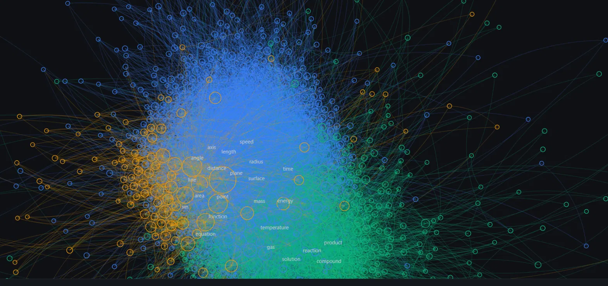

# PYQ Concept Graph

An NLP + graph pipeline for competitive exam analysis — starting with JEE Advanced (2007–2025), extracting technical keywords and building subject-colored co-occurrence networks. JEE Mains and NEET coming next.



## What this does

Every JEE Advanced question (2007–2025) is broken down into its core technical
concepts (e.g. _resistance_, _equilibrium_, _matrix_), then mapped into an
interactive network graph where:

- **Node size** = how many questions that concept appeared in
- **Edge strength** = how often two concepts appear together in the same question
- **Color** = the concept's dominant subject (Physics / Chemistry / Mathematics),
  determined by a trained classifier

Clusters of tightly-connected concepts emerge naturally from the data — you can
see Physics, Chemistry, and Mathematics vocabulary separate into distinct visual
regions just from co-occurrence patterns alone.



## Live search

Paste any question (or just a topic) into the search bar, and the app:

1. Runs it through the same NLP pipeline used to build the graph (tokenize →
   POS-tag → lemmatize → filter), via a live FastAPI backend
2. Highlights every matched concept directly on the graph, dimming everything else
3. Shows each matched concept's **historical recurrence** — the percentage of
   years (out of 19, 2007–2025) it has appeared in at least one question, plus
   the most recent year it showed up

This is a real, computed statistic from the dataset — not a prediction of
whether any specific future question will repeat.

## Pipeline

Raw PDF-extracted questions go through the following stages:

1. **`src/02_clean_text.py`** — strip MCQ markers, symbols, and numbers from raw question text
2. **`src/03_extract_keywords.py`** — NLTK tokenization, POS tagging (nouns only),
   lemmatization, and blacklist filtering to isolate real technical vocabulary
   from exam-format boilerplate
3. **`src/04_classify_subjects.py`** — a trained TF-IDF + Logistic Regression
   model labels each question's subject
4. **`src/05_merge_data.py`** — join extracted terms with predicted subjects
5. **`src/06_subject_color.py`** — determine each keyword's dominant subject by
   counting its occurrences across question subjects
6. **`src/07_build_graph.py`** — build the co-occurrence graph: nodes (keywords
   - frequency) and edges (co-occurrence weight)
7. **`src/08_color_graph.py`** — attach each node's subject color
8. **`src/09_year_stats.py`** — compute each keyword's historical year-by-year
   recurrence, used by the live search feature

(`src/01_explore.py` and `src/09_viewer.html` are early exploration/prototyping
scripts, kept for reference.)

`backend/main.py` is a FastAPI service exposing a `/search` endpoint: it reuses
`extract_terms()` from the same pipeline script, so the live search and the
offline graph-building always stay in sync.

The frontend (`web/`) renders the graph using D3.js force-directed layout, with
zoom/pan, curved colored edges, progressive label reveal on zoom, and live
search highlighting.

## Tech stack

- **Python**: pandas, NLTK, scikit-learn
- **Backend**: FastAPI, uvicorn
- **Frontend**: D3.js (force simulation, zoom behavior), vanilla HTML/CSS/JS

## Running it locally

```bash
python -m venv venv
venv\Scripts\activate
pip install -r requirements.txt

python src/02_clean_text.py
python src/03_extract_keywords.py
python src/04_classify_subjects.py
python src/05_merge_data.py
python src/06_subject_color.py
python src/07_build_graph.py
python src/08_color_graph.py
python src/09_year_stats.py
```

Then, in two separate terminals:

```bash
# Terminal 1 -- backend
uvicorn backend.main:app --reload --port 8001

# Terminal 2 -- frontend
python -m http.server 8000
```

Open `http://localhost:8000/web/index.html`.

## Roadmap

- [x] Interactive force-directed concept graph, colored by subject
- [x] Live search with historical recurrence stats
- [ ] Sequential ("reading") highlight animation on search
- [ ] Public deployment
- [ ] JEE Mains data
- [ ] NEET data

## Data source

Question text sourced from publicly released JEE Advanced previous-year papers.
